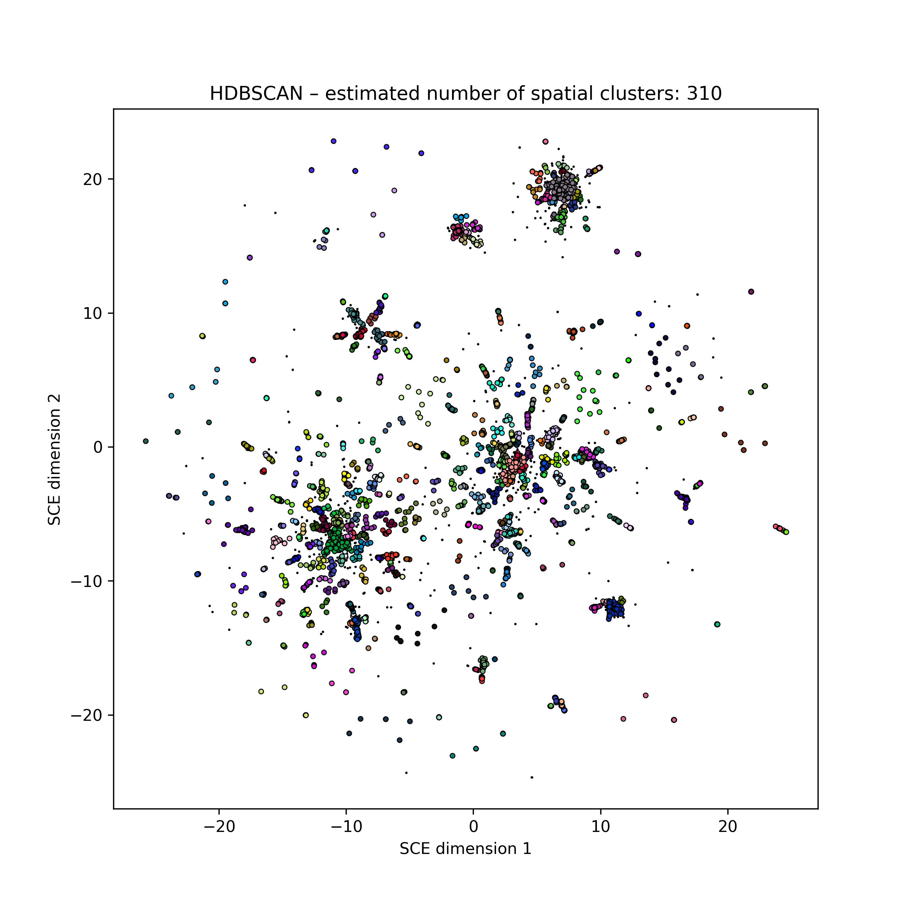
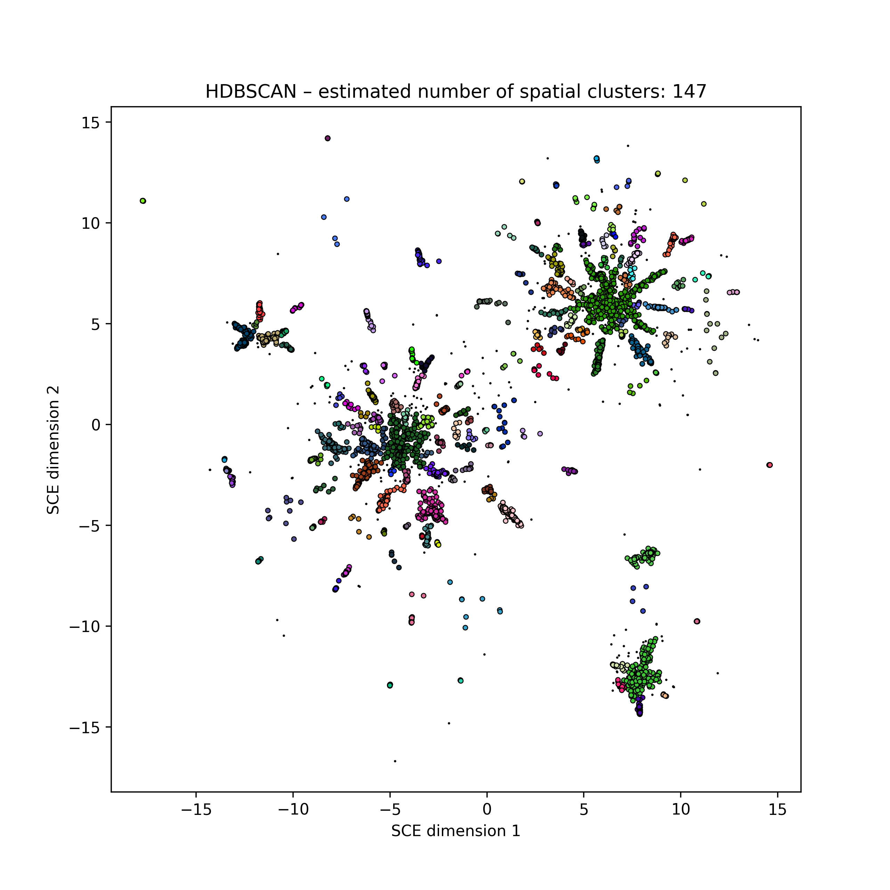
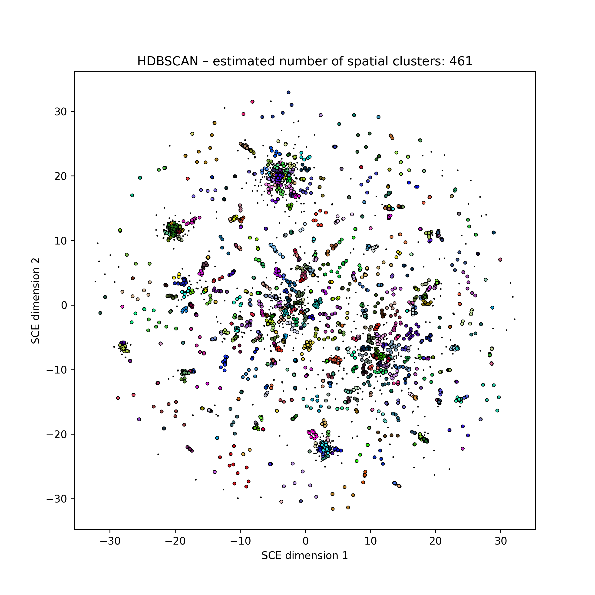
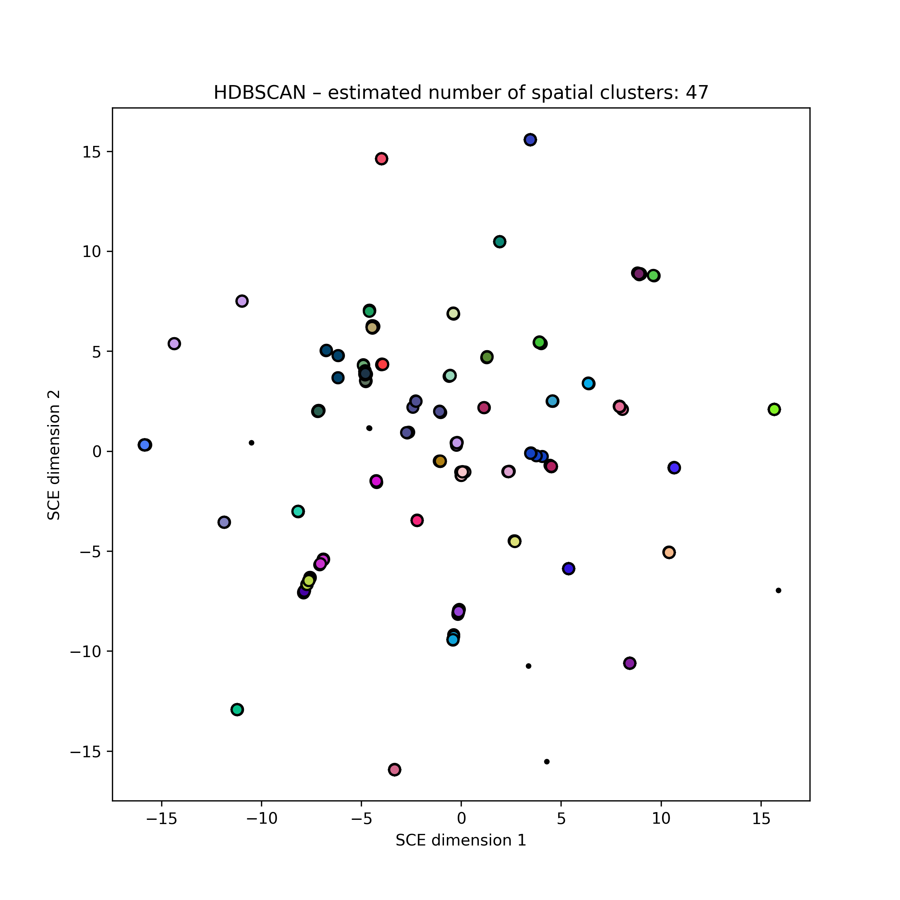
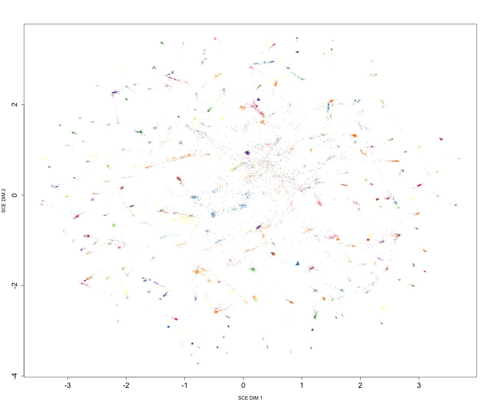
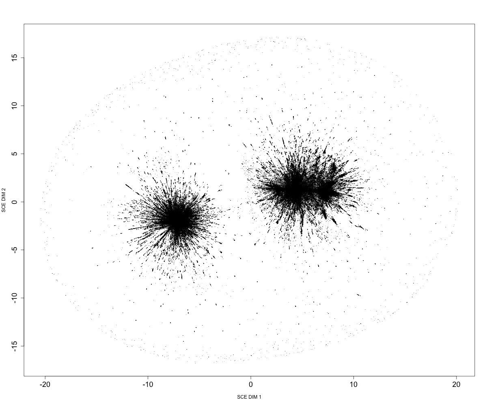

Examples
=================================

Running mandrake on a multiple sequence alignment::

    mandrake --alignment sub5k_hiv_refs_prrt_trim.fas --kNN 500 --cpus 4 \
    --maxIter 30000000

   Embedding of 5k HIV pol sequences (perplexity 15)

Re-running at a different perplexities using these distances::

    mandrake --output perplexity50 --distances mandrake.npz \
    --perplexity 50 --cpus 4 --maxIter 30000000
    mandrake --output perplexity5 --distances mandrake.npz \
    --perplexity 5 --cpus 4 --maxIter 30000000

   Embedding of 5k HIV pol sequences (perplexity 50)

   Embedding of 5k HIV pol sequences (perplexity 5)

Running mandrake on a sketch database, and producing an animation::

    mandrake --sketches mass_sketchlib.h5 --kNN 500 --cpus 4 \
    --maxIter 1000000 --animate

   Embedding of 616 *S. pneumoniae* genome core distances

Running mandrake on gene presence/absence matrix from `panaroo <https://gtonkinhill.github.io/panaroo/#/>`__::

    mandrake --accessory gene_presence_absence.Rtab --kNN 50 --cpus 16 \
    --perplexity 15 --bInit 0 --maxIter 1000000000

   Embedding of ~20k *S. pneumoniae* accessory genome distances

Running mandrake on a very large multiple sequence alignment::

    mandrake --cpus 60 \
    --alignment SC2.fasta \
    --output sc2million \
    --kNN 50 --perplexity 15 --bInit 0 --maxIter 10000000000

   Embedding of ~1M SARS-CoV-2 genomes

Re-running mandrake using a GPU::

    mandrake --cpus 60 \
    --distances SC2.fasta \
    --output sc2million.npz \
    --perplexity 50 --no-clustering\
    --n-workers 94976 --maxIter 1000000000000 --use-gpu \
    --animate --labels sc2million_pangolin.txt --no-html-labels
