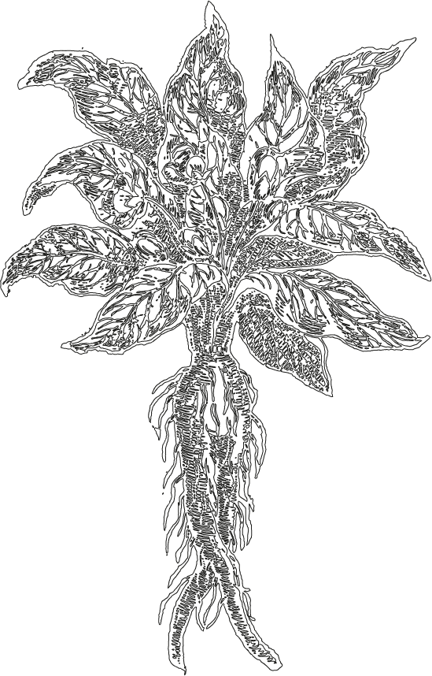

mandrake's documentation
====================================

mandrake is a tool for creating visualisations of pathogen populations from
their genome data. The visualisation produces are optimised to produce clusters of similar sequences,
represented in a two dimensional embedding.

You may wish to use this tool to:

- Get a quick look at the structure of your population, and identify possible clusters.
- See if these clusters match with known labels.
- Determine whether supervised learning is likely to work on this input data.
- Make pretty pictures and animations.

mandrake is primarily a visualisation tool. To determine clusters robustly, we
would recommend a model-based method such as `fastbaps <https://github.com/gtonkinhill/fastbaps>`__
or `poppunk <https://github.com/johnlees/PopPUNK>`__.

To understand local embeddings better, we would recommend the following
excellent guide: https://distill.pub/2016/misread-tsne/.

It can take as input:

- Assembly or read data (using `sketchlib <https://github.com/johnlees/pp-sketchlib>`__).
- A multiple sequence alignment.
- A gene presence/absence matrix.

Runs the following steps:

1. Distance calculation, and sparsification to :math:`k` nearest neighbours, or using a threshold.
2. Conversion of distances to conditional probabilities at the specified perplexity.
3. A modified version of `stochastic cluster embedding <https://arxiv.org/abs/2108.08003>`__.
4. HDBSCAN on the embedding, or labelling with provided categories.
5. Plots of the output.

Producing the following output:

- A numpy version of the sparse matrix, for reuse.
- A text version of the output embedding.
- An interactive HTML file with the embedding, and hover labels.
- A static version of this embedding.
- A hexbin plot to show density of the embedding (which is usually overplotted).
- (optionally) A video of the embedding process as the algorithm runs.

mandrake is very fast, and can be used on millions of input samples.

.. toctree::
   :maxdepth: 1
   :caption: Contents:

   self
   installation.rst
   examples.rst
   parameters.rst
   input.rst
   plots.rst
   web.rst
   animation.rst
   parallelisation.rst
   citing.rst

* :ref:`genindex`
* :ref:`search`
