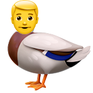

Miscellaneous
=============

Would a man wear his drake like this?

or like this?

.. image:: images/mandrake_logo_v2.1.png
   :height: 140px
   :alt:  drakeman
   :align: center

Is the name a *Harry Potter* reference?
---------------------------------------
Not intentionally

Why mandrake then?
------------------
Initially a `Final <https://finalfantasy.fandom.com/wiki/Mandragora_(Final_Fantasy_IX)>`__
`Fantasy <https://finalfantasy.fandom.com/wiki/Mandragora_(Final_Fantasy_X)>`__ enemy mandragora.

mandrakes are a real plant with a name we thought sounded a bit better. There
are a `few myths about them <https://www.fs.fed.us/wildflowers/ethnobotany/Mind_and_Spirit/mandrake.shtml>`__
which the Harry Potter ones are based on.
