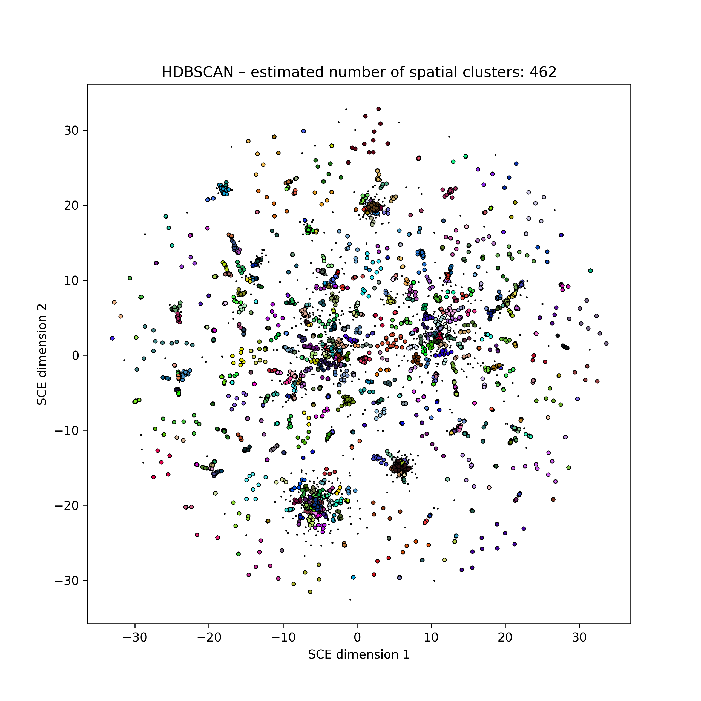
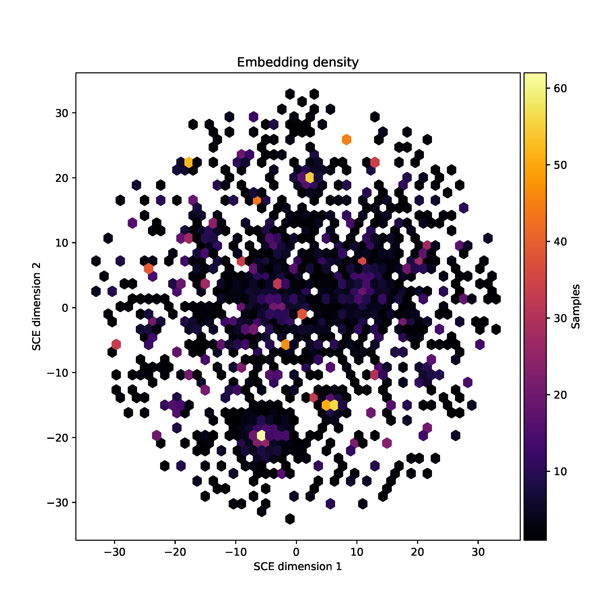

Plots
=====
This page describes the outputs from mandrake. Along with the plots, mandrake
also outputs the embedding as:

- ``mandrake.embedding.txt`` the X-Y coordinates of the embedding as text.
- ``mandrake.names.txt`` the sample names of each row in the embedding file.

Should you wish to create your own plots.

Interactive plot
----------------
An interactive plot of the embedding is written to ``mandrake.embedding.html``,
which can be viewing in your web browser. This plot can be zoomed and panned,
and sample labels will appear when you hover over them. Use the controls in the
top-right to save your view as a static image. Double-click to zoom out.

For large datasets this file may become very large due to the labels, in which
case the static images might be preferred.

Static image
------------
This is a non-interactive version of the embedding written to ``mandrake.embedding_static.png``.
Point size will vary depending
on number of samples :math:`N`:

- Small dataset, large points :math:`N < 1000`.
- Medium dataset, medium points :math:`1000 < N < 10000`.
- Large dataset, small points :math:`N > 10000`.

Points will be coloured by their labels if provided, or otherwise their HDBSCAN
cluster (total number noted in the title). Colours are chosen at random, but consistently
between runs:

Density plot
------------
Due to the nature of the SCE algorithm, many points are likely to be overploted.
This can be investiaged in the HTML plot by zooming in. For larger datasets, a useful
companion to the static image is the hexbin plot ``mandrake.embedding_density.pdf``, which shows the number of points
in each region of the plot, divided into small tesselating hexagons:

